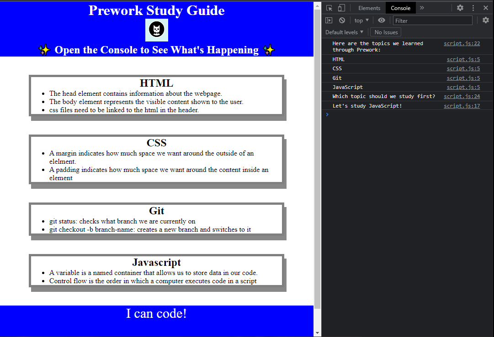

# Prework Study Guide

## Description

The purpose of this study guide is to provide a centralized place for my notes and guides for the Coding Boot Camp. This is done by creating a page that is easily accessible, provides a place for my notes, and is styled to make it easier to find what I am looking for. The step-by-step creation of this study guide has provided a chance to learn through implemention the concepts and practices I am learning and taking notes about.

## Installation

N/A

## Usage

The study has sections to allow an ease of use when looking for specific subject matter. As an example if I needed to find my notes about HTML, there is a section devoted to that subject and is titled as such. When using dev tools a javascript can be seen that will provide a suggested topic to study first.

## Credits

N/A

## License

MIT